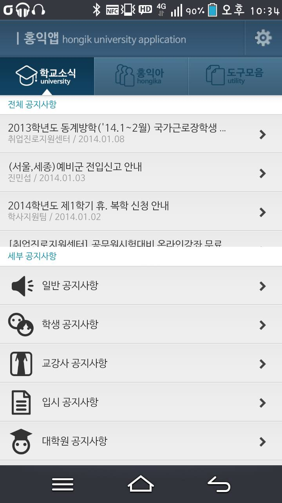
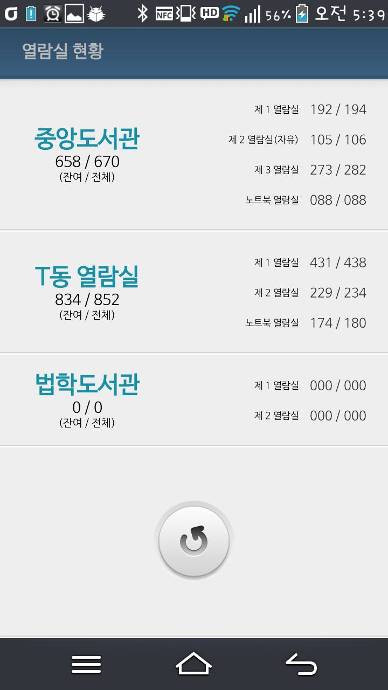
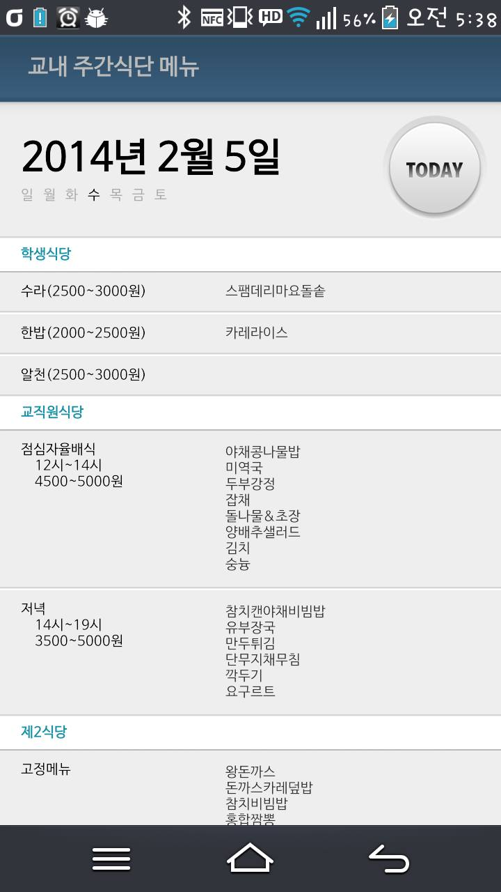
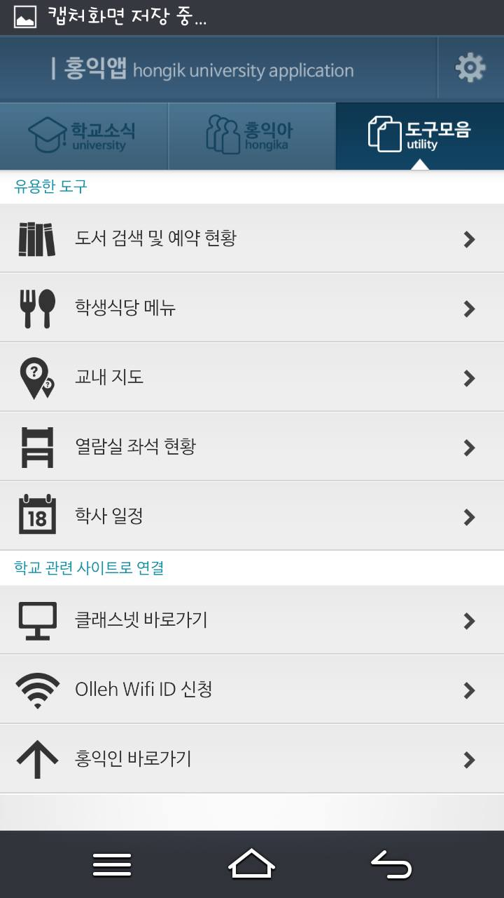

## 소개

### 이한영  

Django를 좋아하는 웹 개발자입니다. 

	

		<a href="https://github.com/leehanyeong" target="_blank">
			
			LeeHanYeong
		</a>
	

	

		<a href="mailto: dev@lhy.kr" target="_blank">
			
			dev@lhy.kr
		</a>
	

	

		<a href="https://lhy.kr" target="_blank">
			
			lhy.kr
		</a>
	

## 보유기술

### 백엔드

- Python, Django, Django REST Framework
- ORM 디버깅 및 쿼리 최적화
- drf-yasg를 사용한 API문서의 생성 자동화

### 배포

- AWS, Docker, Docker Compose를 사용한 컨테이너 기반 배포
- GitHub Action을 사용한 CI/CD구성

### 프론트엔드

- HTML, CSS (Sass)
- Vue.js + ES6 JavaScript

## 경력

- **[티페이](https://www.tpay.co.kr/) (2019.01 ~ 재직중)**

  VAN, 총판, POS통합 결제 시스템 제공 회사  
  계약, 매출, 고객문의등의 데이터를 다루는 내부인원용 관리자 페이지 개발 및 배포 운영

- **패스트캠퍼스 (2016.09 ~ 2018.12)**
  
  커리어 전환을 위한 실무 교육기관  
  Django기반의 웹 개발 교육 전임 강사로, 아래 내용으로 강의
  
  - HTML, CSS, Bootstrap, Django를 사용한 Django application개발
  - DRF를 사용한 API Server application개발
  - Nginx, Gunicorn, Docker, AWS ElasticBeanstalk, Route53을 사용한 배포
  
- **[타운컴퍼니](https://townus.co.kr/) (2015.09 ~ 2016.09)**

  대학생 공동구매 플랫폼  
  공동구매방 개설과 참여형태의 커머스 플랫폼 개발

- **[텐핑거스](https://10fingers.datepop.co.kr/) (2014.10 ~ 2015.01)**

  커플 데이트 큐레이션 서비스  
  모바일 애플리케이션의 API서버와 내부인원용 콘텐츠 관리 페이지 개발 및 배포 운영

- **에이앤티홀딩스 (2012.07 ~ 2013.01)**

  SI 중소기업  
  안드로이드 애플리케이션 개발

## 교육

- 홍익대학교 컴퓨터공학과 학사 (2007.03 ~ 2020.08)

## 경력 외 활동

- 소프트웨어 마에스트로 4기 멘티 (2013.07 ~ 2014.06)
- IT 연합동아리 Mash-Up활동 (2018.09 ~ 2019.12)

## 프로젝트

### [django-quill-editor](https://github.com/LeeHanYeong/django-quill-editor)

[![icon-quill-pypi]][quill-pypi]
[![icon-quill-docs]][quill-docs]
[![icon-quill-github-star]][quill-github-star]

> 오픈소스 프로젝트 (2020.05 ~ )

JS기반의 오픈소스 WYSIWYG에디터인 [Quill.js](https://quilljs.com/)를 Django에서 쉽게 쓸 수 있게 도와주는 라이브러리입니다. 

django-ckeditor, django-summernote와 같은 Django WYSIWYG에디터 라이브러리들은 이미지를 첨부하려면 정적파일 관련 설정을 해야하며, 글 작성시 정해진 경로로 먼저 이미지를 업로드 한 후 에디터에 붙여넣어야 하는 불편한 과정이 있습니다. 이 라이브러리는 Django를 처음 접하는 초심자가 쉽게 WYSIWYG에디터를 자신의 프로젝트에서 사용할 수 있게 해주는 데 가장 집중했습니다.

#### 성과

- 실 사용자들로부터 이슈를 통해 버그리포트를 받고, 버그픽스 PR을 머지해본 첫 오픈소스
- Read the Docs를 사용한 문서화

---

### [django-secrets-manager](https://github.com/LeeHanYeong/django-secrets-manager)

[![icon-dsm-pypi]][dsm-pypi]

> 오픈소스 프로젝트 (2019.09 ~ )

AWS의 [SecretsManager](https://aws.amazon.com/ko/secrets-manager/)서비스를 사용해서 Django의 각종 비밀값들을 쉽게 가져올 수 있도록 도와주는 라이브러리입니다.

여러 컴퓨터를 오가며 프로젝트를 진행하거나, 배포시 버전관리에 포함되지 않는 비밀값들을 동기화하는데 어려움을 느껴 AWS Credential의 관리만으로 비밀값들을 동적으로 가져올 수 있도록 하였습니다.

#### 성과

- 사용하는 모든 Django프로젝트에서 비밀값 관리를 위해 이 라이브러리를 사용

---

### tBoard 

> 티페이 (2019.01 ~ 재직 중)

티페이의 사내 ERP인 tBoard의 백엔드 및 프론트엔드 개발과 배포를 맡았습니다. 기존 레거시 프로젝트의 문제점을 해결하고, 문서화와 배포 자동화 등 개발 문화 개선 작업을 진행했습니다.

내부적으로 계약, 매출, 물류, 고객문의 기능을 개발했으며, 서로 연결되는 데이터가 많아 지금까지 다뤄본 것 중 가장 복잡하게 쿼리를 사용해보았습니다.

#### 사용기술

- 백엔드: DRF (drf-yasg를 사용한 문서화)
- 프론트엔드: Vue.js
- 배포: EC2, Docker, Docker Compose, GitHub Action CI

#### 레거시 개선

- Python2.x, Django1.x의 버전업 (Python 3.x, Django 2.x)
- JsonResponse로 직접 처리되던 API들을 DRF방식으로 변환
- pre-commit을 사용한 커밋 전 Code Lint, 컨벤션 적용
- Raw SQL로 처리되던 로직의 ORM화 및 Slow Query개선
- Sentry를 사용한 에러트래킹 시스템 도입

#### 성과

- Django와 DRF 확장기능들을 도입, 속도 및 생산성 향상
  - **django-mptt**  
    재귀적으로 사용되는 모델의 트리 구조화
  - **drf-yasg**  
    DRF 구조를 기반으로 한 문서 자동화
  - **Django REST Framework Social OAuth2**  
    python-social-auth와 django-oauth-toolkit을 기반으로 한 소셜 OAuth인증 라이브러리
- pytest를 사용한 테스트 도입
  - 버그픽스나 신규기능 작성시 테스트코드를 포함하여 PR
- 여러 테이블을 거치는 쿼리 최적화

---

### 타운어스 

> 타운컴퍼니 (2015. 09 ~ 2016. 09)

대학생 공동구매 플랫폼 "타운어스"를 기획부터 출시, 운영까지 전반적인 개발 파트를 담당했습니다.

#### 사용기술

- 관리자 사이트: Django admin
- API 백엔드: DRF
- 유저 프론트엔드: AngualrJS (1.x)
- 배포: 가상서버의 Ubuntu Linux, Nginx

#### 성과

- 플랫폼의 시작부터 기획, 출시 및 운영
- 프론트엔드 프레임워크를 사용한 사용자 페이지 제작
- 느린 쿼리결과에 캐시 사용

---

### 데이트팝 

> 텐핑거스 (2014.10 ~ 2015.01)

커플 데이트 큐레이션 서비스 "데이트팝"의 API서버와 관리자 페이지를 개발했습니다. 기존에 JSP로 되어있던 API를 Django와 DRF로 적절히 마이그레이션하고, AngularJS를 사용해 페이지 전환없이 Ajax방식으로 콘텐츠를 관리할 수 있는 관리자 페이지를 구성했습니다.

#### 사용기술

- 관리자 사이트: Django admin + AngularJS (1.x)
- API 백엔드: DRF
- 배포: Google App Engine (PaaS, Django)

#### 성과

- 기존 자바 백엔드에서 동작하던 DB를 Django에 성공적으로 Migration
- 배포에 Google App Engine(PaaS)를 사용
- jQuery로 일일이 DOM을 다루던 방식에서 프론트엔드 프레임워크를 사용하는 방식으로 변경

---

### 홍익앱 

> 개인프로젝트 (2013 ~ 2014)

분산되어 있는 교내 정보들을 스크래핑하여 모아 보여주던 애플리케이션입니다. 마지막으로 제작했던 안드로이드 앱입니다.

   

#### 성과

- Java를 사용한 스크래핑으로 구성한 프로젝트
- 단순 식단제공 기능부터 열람실현황, 도서검색 등의 기능을 추가하며 점점 발전해 나감
- 실 다운로드 1000회이상 달성, 등록유저 1500여명, 운영기간 1년 이상

[icon-letusgo-github-action]: https://img.shields.io/github/workflow/status/LeeHanYeong/let-us-go/CI/develop.svg
[letusgo-github-action]: https://github.com/leehanyeong/let-us-go/actions?query=workflow%3ACI
[icon-letusgo-codecov]: https://img.shields.io/codecov/c/github/LeeHanYeong/let-us-go/master.svg
[letusgo-codecov]: https://codecov.io/github/LeeHanYeong/let-us-go
[icon-letusgo-apidoc]: https://img.shields.io/badge/doc-drf--yasg-blue.svg
[letusgo-apidoc]: https://api.letusgo.app/doc

[icon-quill-github-star]: https://img.shields.io/github/stars/leehanyeong/django-quill-editor
[quill-github-star]: https://github.com/leehanyeong/django-quill-editor
[icon-quill-pypi]: https://badge.fury.io/py/django-quill-editor.svg
[quill-pypi]: https://badge.fury.io/py/django-quill-editor
[icon-quill-docs]: https://readthedocs.org/projects/django-quill-editor/badge/?version=latest
[quill-docs]: https://django-quill-editor.readthedocs.io/en/latest/?badge=latest

[icon-dsm-pypi]: https://badge.fury.io/py/django-secrets-manager.svg
[dsm-pypi]: https://badge.fury.io/py/django-secrets-manager

